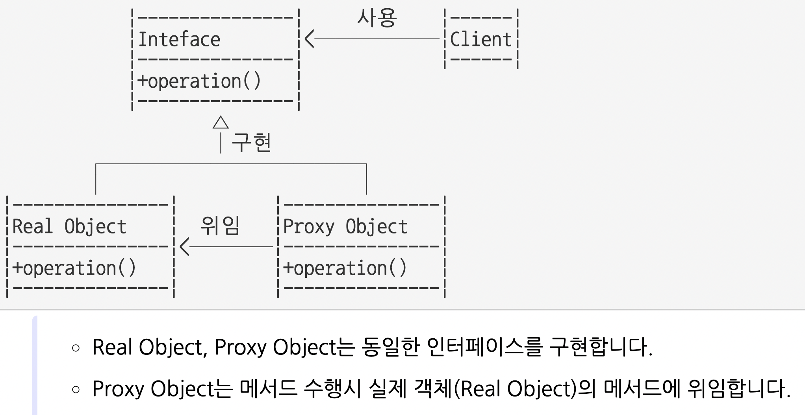
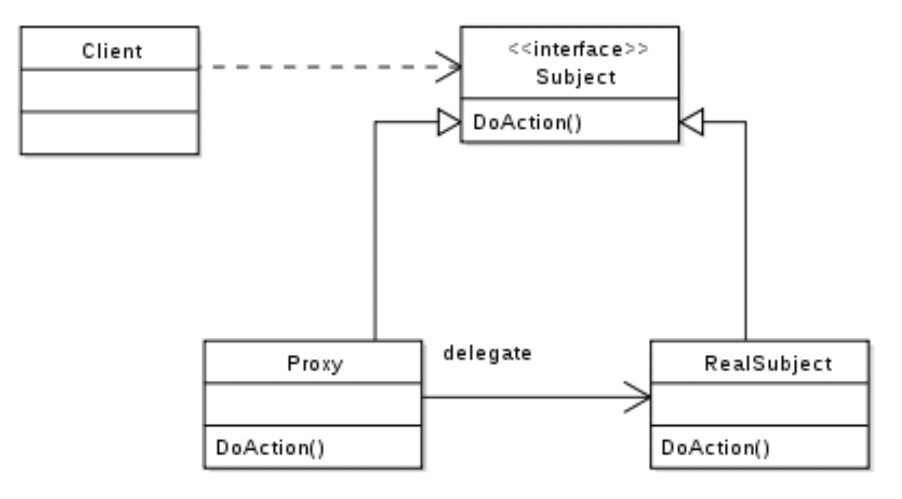
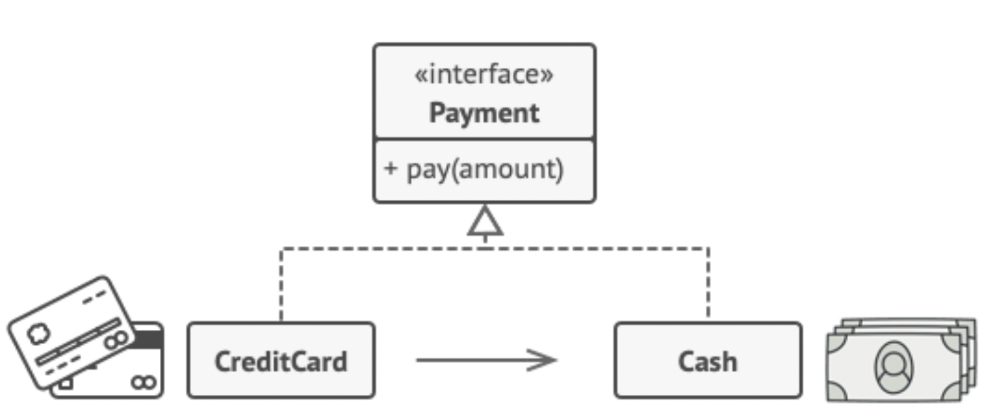
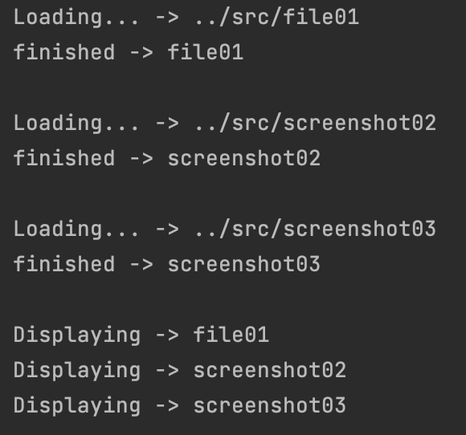
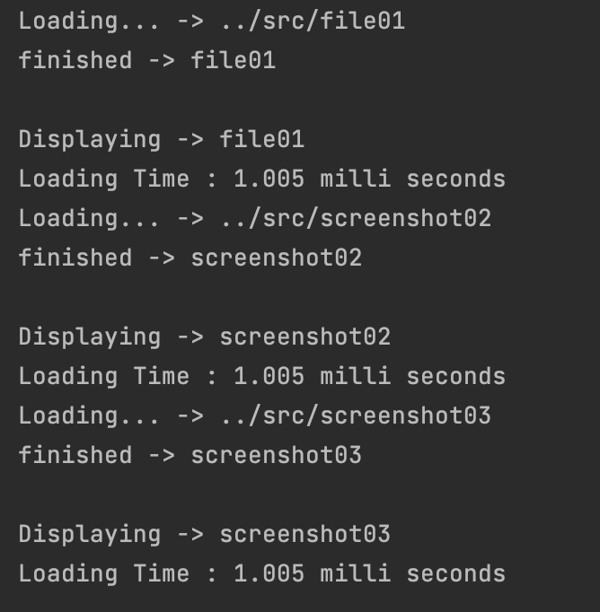

# [Design Patten] Proxy

<br><br>

<aside>

🖊️ 디자인 패턴을 개인적으로 공부해 정리한 내용입니다.

</aside>

<br>

---

<br><br>

## **✅ Proxy pattern**

Proxy : 대리자, 대변인 이라는 뜻
프록시에게 어떤 일을 대신 시키는 것

- 어떤 객체를 사용하고자 할때, 객체를 직접적으로 참조 하는것이 아니라, **`해당 객체를 대행(대리, proxy)하는 객체를 통해 대상 객체에 접근하는 방식`**
- 해당 객체가 메모리에 존재하지 않아도 기본적인 정보를 참조하거나 설정할 수 있고 또한 실제 객체의 기능이 반드시 필요한 시점까지 객체의 생성을 미룰 수 있다.

<br>

- `원래 하려던 기능을 수행하며 그 외의 부가적인 작업(로깅, 인증, 네트워크 통신 등)을 수행`하기에 좋다. 
- `비용이 많이 드는 연산(DB 쿼리, 대용량 텍스트 파일 등)을 실제로 필요한 시점에 수행`할 수 있다. 
- 사용자 입장에서는 프록시 객체나 실제 객체나 사용법은 유사하므로 사용성이 좋다.

<br>

## ⏺ 내가 이해한 흐름

1) client가 interface를 바라보고있고, 해당 interface를 상속받는 어떤 <**객체**>를 사용하고자 할 때,
2) 해당 Interface를 상속받으면서 동시에 <**객체**>가 사용되는 <**프록시 객체**>를 하나 생성한다.
3) 부가작업을 하게 되는 경우엔 <**프록시 객체**>를 호출한다.
4) 부가작업이 필요 없는 경우엔 원래 <**객체**>를 호출한다.

<br>

### 💻 example 01
용량이 큰 이미지와 글이 함께 있는 문서를 모니터에 띄우는 상황



- 텍스트는 용량이 작은데 이미지 용량이 커서 이미지가 약간 느리게 로딩되는 경우가 있다
- 만약 모두 로딩이 된 후에 화면이 나오면 의미없는 기다림이 생긴다
- 먼저 로딩이 되는 텍스트라도 먼저 나오는게 좋고, 이런 방식을 취하기 위해 텍스트 처리 프로세서 / 그림 처리 프로세스를 별도로 운영하게 된다.

- 결국 프록시 패턴은 다른 무언가와 이어지는 인터페이스의 역할을 한다.


<br>

### 💻 example 02
현금과 카드의 상황 : 현금으로 대용량(10억이 있다고 했을때)을 들고다니기엔 너무 불편하다.

- 현금은 결제할 때 외엔 사용하지 않지만 들고다니기 불편하고 위험하다.
- 카드는 안전하고 들고 다니기에 부담이 없으며 현금을 대신할 수 있다.


막 엄청 예시가 와닿지는 않는다.
코드 예제를 보면서 공부를 해보자.


<br>

---

<br>

## ✅ 코드 설명

<br>

### 💻 Image (Interface)
```java
public interface Image {
    void displayImage();
}
```

<br>

### 💻 Real_image
```java
package proxy_pattern.ExampleImage;

public class Real_Image implements Image{

    private String fileName;
    private String filepath;

    public Real_Image(String filepath) {
        this.filepath = filepath;
        fileName = loadFromDisk(filepath);
    }

    private String loadFromDisk(String filepath) {
        System.out.println("Loading... -> " + filepath);
        String[] pathName = filepath.split("/");
        String name = pathName[pathName.length-1];
        System.out.println("finished -> " + name);
        System.out.println();
        return name;
    }

    @Override
    public void displayImage() {
        System.out.println("Displaying -> " + fileName);
    }
}


```

<br>

### 💻 Proxy_Image

```java
package proxy_pattern.ExampleImage;
import java.time.LocalDateTime;

public class Proxy_Image implements Image {
    private Real_Image real_image;
    private String fileName;
    private String filePath;

    public Proxy_Image(String filePath) {
        this.filePath = filePath;
    }

    @Override
    public void displayImage() {
        if (real_image == null) {
            real_image = new Real_Image(filePath);
        }

        long startTime = System.currentTimeMillis();

        try {
            real_image.displayImage();
            Thread.sleep(1000);
        } catch (InterruptedException e) {
            e.printStackTrace();
        }

        long estimatedTime = System.currentTimeMillis() - startTime;

        System.out.println("Loading Time : " + estimatedTime/1000.0 + " milli seconds");

    }
}
```

<br>

### 💻 Main

```java
package proxy_pattern.ExampleImage;

public class Main {
    public static void main(String[] args) {

        /*
        // 프록시 미사용
        Image img1 = new Real_Image("../src/file01");
        Image img2 = new Real_Image("../src/screenshot02");
        Image img3 = new Real_Image("../src/screenshot03");
        */


        //프록시 사용
        // 1) 클라이언트는 Real_Image에 직접 접근하지 않는다.
        // 2) Proxy_Image 객체를 생성한다. Proxy는 Real_Image의 displayImage()를 호출한다.
        Image img1 = new Proxy_Image("../src/file01");
        Image img2 = new Proxy_Image("../src/screenshot02");
        Image img3 = new Proxy_Image("../src/screenshot03");

        img1.displayImage();
        img2.displayImage();
        img3.displayImage();

    }
}
```

<br><br>


### ✔️ 프록시 미사용 결과 (Real_Image)


<br>

### ✔️ 프록시 사용 결과 (Proxy_Image)



1) Proxy_Main에서 Real_Image에 직접 접근하지 않고 Proxy_Image 객체를 생성하여 대신 시킴. 
2) Proxy는 displayImage() 메서드를 호출하고 그 반환값을 Main에 반환함


<br><br><br>

---


### references

<aside>

- https://coding-factory.tistory.com/711
- https://jdm.kr/blog/235

</aside>