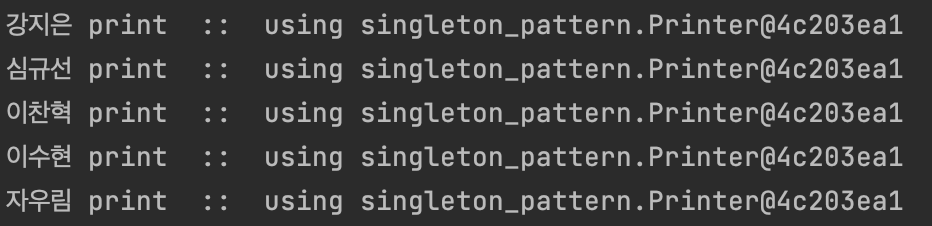
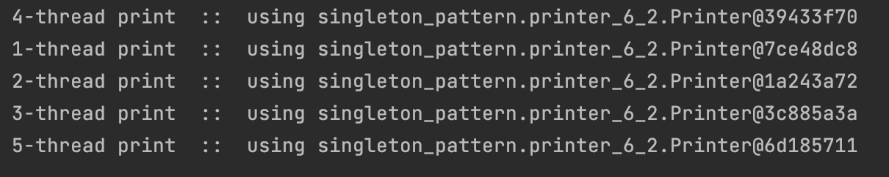
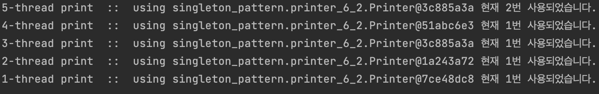
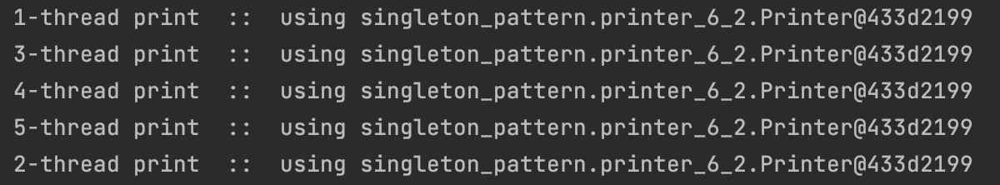
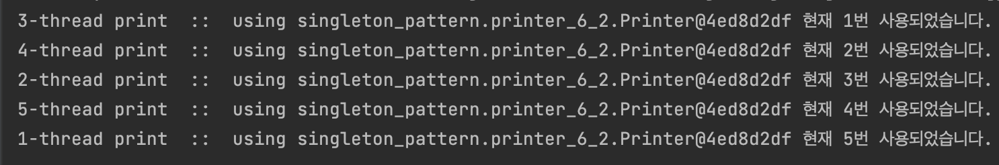

# [Design Patten] Singleton

<br><br>

<aside>
🖊️ Java 객체지향 디자인 패턴 책을 개인적으로 공부해 정리한 내용입니다.

</aside>

---

<br><br>

## **✅ Singleton  pattern**

객체의 인스턴스가 오직 1개만 생성되는 패턴

<br>

```java
public class Singleton {

    private static Singleton instance = new Singleton();

    private Singleton() {
        // 생성자는 외부에서 호출못하게 private 으로 지정
    }

    public static Singleton getInstance() {
        return instance;
    }

    public void say() {
        System.out.println("hi, there");
    }
}
```

<br><br>

### **⏺ 싱글톤 패턴을 사용하는 이유**

인스턴스를 1개만 가져가면 어떤 이점이 있을까?

<br>

- **메모리 측면**
    - 최초 1번의 new 연산자를 통해 고정된 메모리 영역을 사용하기 때문에 추후 해당 객체에 접근할 때 메모리 낭비를 방지할 수 있음.
    - 생성된 인스턴스를 활용함으로써 속도 측에서도 이점이 있다.
- **데이터 공유가 쉬움**
    - 싱글톤 인스턴스는 전역으로 사용됨
    - 다른 클래스의 인스턴스들이 접근해 사용할 수  있음
    - 단 여러 클래스의 인스턴스에서 싱글턴인스턴스 데이터에 동시 접근시 동시성 문제가 발생할 수 있다.

<br><br>

### **⏺ 싱글톤 패턴의 문제점**

- 싱글톤 패턴을 구현하는 코드가 많이 필요함.
- 테스트하기 어렵다.
    - 테스트가 결정적으로 격리된 환경에서 수행하기 위해 매번 인스턴스의 상태를 초기화 해주어야한다.
    - 초기화를 안해주면, 어플리케이션 전역에서 상태를 공유하기떄문에 테스트가 온전하게 사용되지 못함
- **클라이언트가 구체 클래스에 의존하게 됨.**
    - new 키워드를 직접 사용해 클래스 내부에서 객체를 생성하고 있기 때문에 SOLID원칙 중 **DIP(Dependency Inversion Principle)의존성 역전 원칙을 위반**하게 됨

<br><br>

→ 단독으로 사용될 경우 객체지향에 위반되는 사례가 많지만, 스프링 컨테이너 같은 프레임워크의 도움을 받으면 싱글톤 패턴의 문제를 보완하면서 장점의 혜택을 누릴 수 있음.

→ 스프링 빈은 컨테이너의 도움을 받아 싱글톤으로 관리됨.

<br><br>

---

<br><br>

### 💻  실습코드 설명

### printer_6_1
- Printer : 싱글톤으로 관리될 클래스
- User : 싱클톤객체(프린터기)를 생성하고, 사용하는 클래스
  - print() : 사용 되는 싱글톤객체의 주소 확인
- Main : User를 생성하고, print()메소드를 출력



<br>

### 문제점?

- 다중 스레드에서 Printer class를 이용할 경우 인스턴스가 1개 이상 생성되는 경우가 발생할 수 있음
- 경합조건 : 메모리가 같은 동일한 자원을 2개 이상의 스레드가 이용하려고 경합하는 현상..

<br>

### printer_6_2

- Printer : 싱글톤으로 관리될 클래스
  - getPrinter() : 스레드를 잠시 정지시키고, printer를 생성하게 해서 여러개의 쓰레드가 동시에 접근하고, 결국 싱글톤이 아닌 여러개의 인스턴스가 나타나는것을 확인할 수 있음.
- UserThread : 싱클톤객체(프린터기)를 생성하고, 사용하는 클래스
  - print() : 사용 되는 싱글톤객체의 주소 확인
- Client: UserThread를 생성하고, 모든 쓰레드 start()



결국 멀티스레드 환경에선 문제가 생긴다.

<br>

만약  프린트 클래스가 상태를 유지해야하는 경우에는?

- 프린터 출력 횟수가 정해져있어서, counter 변수를 사용해 상태를 유지해야하는 상황이라고 가정

```java
public class Printer {
    private static Printer printer = null;
    private int counter = 0; //(1)상태를 유지해야하는 변수 생성

    private Printer(){}

    public static Printer getPrinter() {
        if (printer == null) {
            try {
                Thread.sleep(1);
            }
            catch (InterruptedException e) {

            }
            printer = new Printer();
        }
        return printer;
    }
    public void print(String str) {
        counter++; //(2) 상태 변경
        System.out.println(str + " 현재 " +counter+"번 사용되었습니다.");
    }
}
```

기대한 결과와 다르게 나오는 것 확인



<br><br>

### ✅ 다중 스레드 어플리케이션에서 발생하는 문제를 해결하는 방법

<br>

1️⃣  **정적 변수에 인스턴스를 만들어서 바로 초기화** 하는 방법

```java
private static Printer printer = new Printer();
```

- 정적 변수는 객체가 생성되기 전, 클래스가 메모리에 로딩될 때 만들어져서 초기화가 한번만 실행 됨
- 다중 스레드에서 문제가 되었던 printer == null 조건 검사문 제거



<br>

2️⃣ **인스턴스를 만드는 메서드에 동기화 하는 방법**

```java
public synchronized static Printer getPrinter() { 
	//생략
}
```

- 다중 스레드에서 getPrinter메서드를 여러개의 스레드가 접근하는 걸 방지함.


<br>

### 프린트 클래스가 상태를 유지해야하는 변수 (counter)도 동기화 해줘야한다.

- 객체는 하나만 생성되었지만. 여러개의 스레드가 counter 변수값에 동시에 접근할 수는 있음

```java
synchronized (this) {
	counter++; 
	System.out.println(str + " 현재 " +counter+"번 사용되었습니다.");
}
```



---

 <br>

### References
- Java 객체지향 디자인 패턴 (정인상, 채홍석)
- [https://tecoble.techcourse.co.kr/post/2020-11-07-singleton/](https://tecoble.techcourse.co.kr/post/2020-11-07-singleton/)